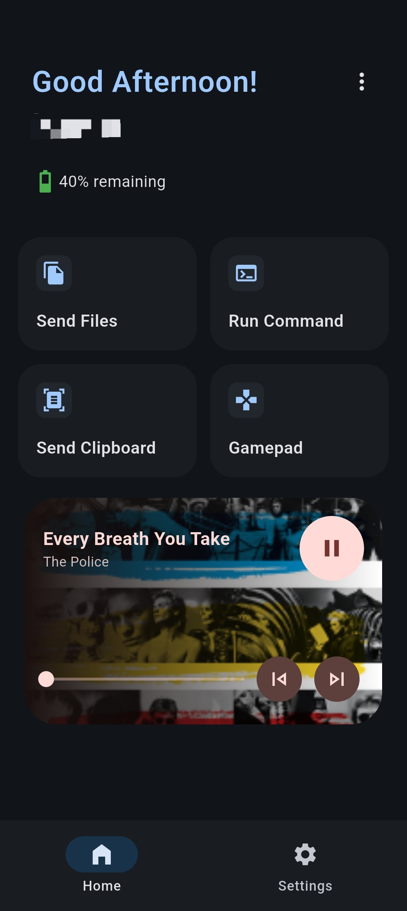
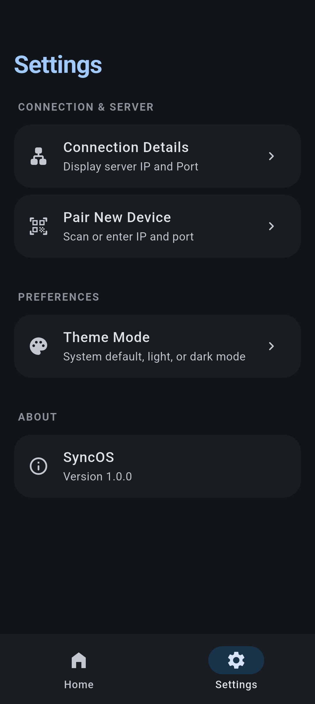
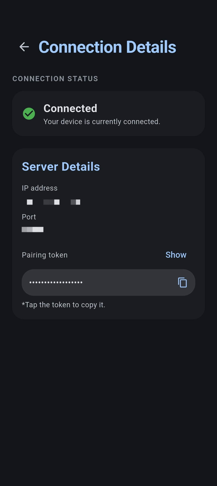
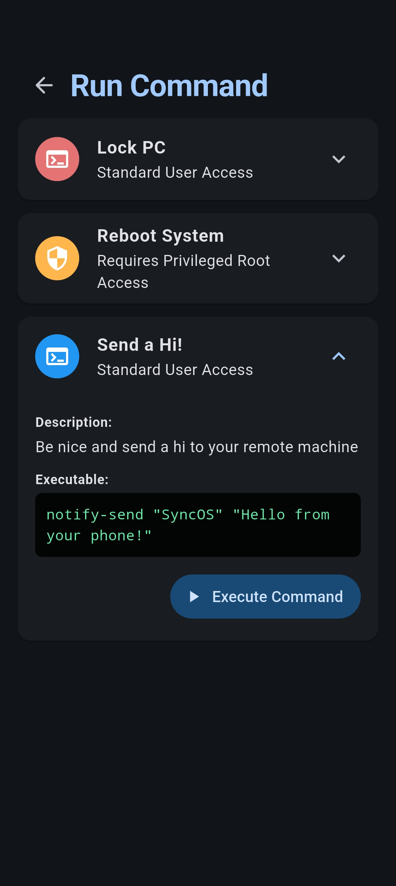
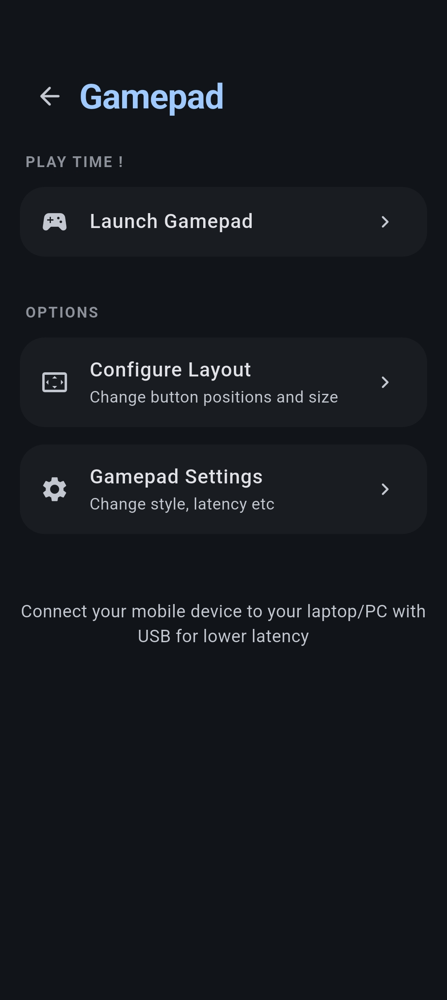

# SyncOS 

SyncOS is a hobby project I made to solve those annoying little everyday friction points when using my laptop and phone at the same time. No more sending files to myself on whatsapp or awkward setups. Just a simple, helpful bridge between devices. Best of all, I've kept it completely open source!

---

## Cool Stuff It Can Do

* **Automatic Pairing:** Open the apps and let them find each other without manual settings.
* **Notification & Media Sync:** See your phone's notifications and media updates pop up seamlessly on your computer.
* **Quick File Transfers:** Send photos, documents, and folders back and forth instantly.
* **Remote Media Control:** Pause, play, or skip music running on your device from across the room.
* **Run Quick Commands:** Fire off basic terminal commands on your machine straight from your phone interface.
* **Wireless Gamepad:** Turn your phone into a controller over Wi-Fi or USB to play games on your computer.
* **Status Monitor:** Keep an eye on your battery levels and ring your misplaced phone to find it.
* **Beautiful Layouts:** Built entirely using Flutter for a clean, cohesive look on both your mobile device and desktop layout.

---

## Try It Right Now! (Pre-Release)

You don't need to build the app from scratch to try it out! I have published a **Pre-Release APK** so you can install it directly on your phone:

1. Head over to the **[Releases](../../releases)** section on the right side of this GitHub page.
2. Download the `SyncOS-v1.0.0.apk` file from the latest asset list.
3. Transfer it to your Android device and open it to install it! *(Make sure to allow installing apps from unknown sources if your phone asks)*.

---

## Screenshots

### Android interface

| Main Dashboard | Settings | Connection Details | Remote Command | Wireless Gamepad |
| :---: | :---: | :---: | :---: | :---: |
|  |  |  |  |  |
---

## Setup Guide
If you are a developer and want to modify the app, fix bugs, or build it locally, follow this setup guide to get your environment ready.

### Prerequisites
Make sure you have the following installed on your development machine:
* **Flutter SDK** (Latest stable version)
* **Android Studio / Android SDK** (for mobile debugging)

### 1. Get the Source Code
Clone this repository to your local machine and jump into the project directory:
```text
git clone https://github.com/Someone-Unknown69/SyncOS-Android
cd SyncOS-Android

```
# Step-by-Step Setup Guide

Follow these steps to get everything up and running smoothly:

---

## Setting Up the Mobile Project

1. Connect your Android phone to your computer using a USB cable.
2. Ensure **USB Debugging** is enabled in your phone's **Developer Options**.
3. Open a new terminal and navigate to your mobile project folder.

Install the required dependencies:

```bash
flutter pub get
```
### Again the project uses code generation

Run the following commands to regenerate the generated files:

```bash
flutter clean
flutter pub get
dart run build_runner build --delete-conflicting-outputs
```

### Launch the app on your connected device:

```bash
flutter run
```

---

## Building a Release APK

To generate a shareable release APK, run:

```bash
flutter build apk --release
```

The generated APK will be available at:

```text
build/app/outputs/flutter-apk/app-release.apk
```

---

## A Quick Note

This app is still under active development in my free time. You may occasionally encounter bugs or unfinished features. I'm continuously improving it and fixing issues as they arise.

If you'd like to contribute, feel free to open an issue or submit a pull request. Every bit of feedback and help is appreciated!

## License
This project is licensed under the GNU General Public License v3.0. See the LICENSE file for more details.